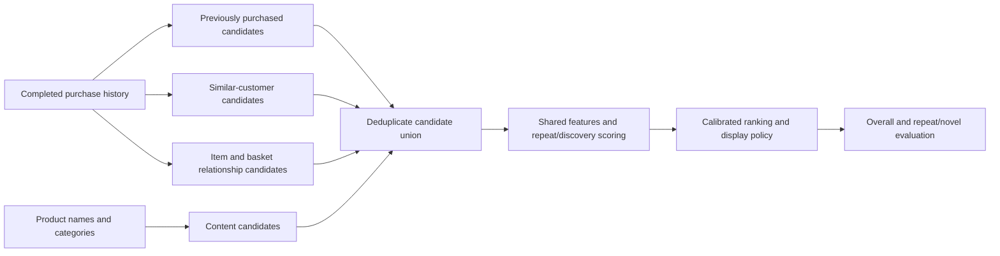

# Model research and project alignment

Research date: 30 September 2026. This document audits the existing repository and proposes experiments. It does not report improvements from models that have not been trained.

## 1. Recommendation

Complete the original reorder probability and ranking project, then develop new-product discovery as a separately measured extension. The best next modeling investments are **time-weighted collaborative filtering, product identity and replenishment features, and a controlled CatBoost/XGBoost comparison**. Discovery needs a better retriever before another large mixed-ranking experiment.

The existing evidence does **not** establish an irreducible accuracy ceiling. It establishes modest improvements over frequency for one feature representation, diminishing returns from increasing its training population, and weak results from several limited discovery pilots. Earlier claims that we had exhausted the dataset, or that a reorder model fundamentally contradicted the brief, were too strong.

## 2. What the original project actually requires

Project 1 estimates which previously purchased products a customer will buy in their next basket, using a reorder probability model followed by Top-K ranking.

| Project requirement | Current evidence | Work needed |
| --- | --- | --- |
| EDA and data quality | Key, join, order-sequence and missingness checks in `data.py`; summary statistics and error slices | A readable exploratory analysis explaining basket size, repeat behavior, product concentration and history length |
| Customer-product feature engineering | 22 historical features in the main model | Document definitions and availability; evaluate product/category identity and richer replenishment signals |
| Candidate generation | All previously purchased products; experimental new-item retrieval | Document coverage; strengthen discovery if pursuing the extension |
| Baseline, Logistic Regression, Random Forest, XGBoost, CatBoost | Frequency and XGBoost evaluated extensively; older logistic results; RF smoke test; CatBoost implementation hook | One comparable benchmark for all five with the same timing, users and features; no evidence of a completed CatBoost run |
| Reorder probability | XGBoost binary classifier with probability diagnostics | Check calibration at displayed ranks and within important groups |
| Top-K recommendation ranking | Working CLI, fixed lists and optional score cutoff | Retain a clear distinction between a ranked panel and a predicted reorder set |
| Classification and ranking metrics | AP, precision, recall, F1/F0.5, P@K, R@K, NDCG@K | Consolidate into one report; state every denominator and split |
| Business interpretation and SHAP | Limited narrative; no SHAP deliverable found | Explanations, error examples, operating tradeoffs and a model card |

New-to-customer recommendations became an additional objective during development. In-session cart completion is another optional extension of the core reorder probability and ranking task.

## 3. What we predict and how to judge it

For customer `u`, product `i`, and available completed-order history `H`, the core target is:

`q(u, i) = P(product i appears anywhere in the next basket | H)`

The current core evaluates this only for products in the customer's purchase history. XGBoost's binary classifier produces probability estimates; logistic regression is not the only model that can do so. Several items can be bought together, so their marginal probabilities do not need to sum to one.

For a five-slot panel, selecting the five highest true marginal probabilities maximizes the expected number of correct items: expected hits are the sum of those probabilities. This follows from linearity of expectation and does not require independent item purchases. The difficulty is estimating the probabilities accurately. A basket-size model is not necessary to make this ranking well-defined.

A customer can buy fewer than five products. Consequently, fixed P@5 can penalize even a perfect ranking. Report both:

- **Fixed panel:** P@1/3/5/10, correct items per customer, recall and NDCG. P@5 uses five slots for every eligible customer, including unfilled slots.
- **Selective panel:** precision among displayed items, displayed items per customer, correct items per customer and the fraction receiving nothing. A higher cutoff can improve displayed precision by reducing coverage.

The variable-length reorder set remains useful as a separate output. F0.5 is a reasonable secondary decision criterion given the user's emphasis on correct suggestions. It does not replace the ranking objective.

## 4. Audit findings from our own data

### 4.1 The current score is reproducible

I independently joined the saved full-model recommendations to raw target purchases. All saved labels agreed. There were **38,144 hits across 98,410 five-slot opportunities for 19,682 users: P@5 = 0.387603**. The reproducible check is [research_audit.py](../experiments/research_audit.py), with counts in [research_audit.json](research_audit.json).

| Existing full-model test result | Value | Interpretation |
| --- | ---: | --- |
| XGBoost P@5 | 0.3876 | 1.938 correct items per customer |
| Frequency P@5 | 0.3422 | 1.711 correct items per customer |
| Absolute improvement | 0.0455 | Approximately 0.227 more correct items per customer |
| Repeat-candidate oracle P@5 | 0.7139 | Retrospective upper bound if ranking were perfect |
| Repeat-candidate recall | 0.5961 | Share of all purchased target items available to the reorder ranker |
| Precision at the selected 0.36 threshold | 0.5232 | Variable-length output, averaging 3.73 items |
| Item-level average precision | 0.4205 | Summarizes candidate-level precision/recall ranking |

Source: [full_v2 metrics](../artifacts/full_v2/metrics.json). The 59.6% candidate recall is **not a 59.6% ceiling on P@5**. Many baskets contain enough repeats to fill five slots. The 71.4% oracle demonstrates that missing novel candidates cannot explain the whole gap, but it is not an attainable performance promise: the oracle sees the answer.

On decision-validation users, filtering the top five at 0.5 produces 64.1% displayed precision, 1.46 displayed items per customer and 41.6% empty panels. This is an operating tradeoff, not a model accuracy gain. Source: [validation diagnostics](../artifacts/full_v2/validation_diagnostics.json).

### 4.2 Discovery loses most positives before ranking

I reproduced retrieval on the **3,000 validation users of the existing pre-order pilot**, using its saved index. These are drawn from the original full-run training population. They are not the full-model test users.

| Retrieval audit | Count or rate |
| --- | ---: |
| Complete product catalog | 49,688 products |
| Searchable co-basket catalog | 3,000 products, 6.04% of the catalog |
| Actual next-basket items | 31,354 |
| Actual new-to-customer items | 12,829 |
| New items inside the searchable catalog | 8,191, or 63.85% of actual new purchases |
| New items found among up to 40 candidates/user | 1,372, or **10.69% novel recall** |
| Recall within the searchable new-item targets | 16.75% |
| Positive rate among retrieved new candidates | 1.19% |
| Users with no last-basket item in the index | 116 of 3,000 |
| Popular unseen products, same training histories, 40/user | 1,216 hits, or **9.48% novel recall** |
| Repeat-only candidate oracle P@5 | 0.6991 |
| Expanded candidate oracle P@5 | 0.7319 |
| Full-catalog oracle P@5 | 0.8854 |

Source: [audit counts and definitions](research_audit.json). The co-basket index and matched popularity baseline both use prior histories of the same 14,000 fit users. The co-basket method returned fewer than 40 candidates for some users; both have the same maximum budget. These are descriptive differences, without a significance test.

This identifies two separate retrieval problems. The catalog cap excludes **36.15%** of actual novel purchases. Even among eligible novel purchases, retrieval misses **83.25%**. Expanding the catalog alone will not solve the second problem. Current personalized retrieval finds only 156 more novel positives than simple unseen popularity at this budget.

The mixed ranker also has work to do: in the existing validation run, it showed 99 new items in its top-five lists and hit one. Yet increasing candidate oracle P@5 from 0.6991 to 0.7319 gives only 0.0328 of additional theoretical headroom from this particular retriever. Stronger retrieval is a better next diagnostic than repeatedly changing the mixed classifier.

The older pilot's reported candidate recall of 0.597 to 0.639 pooled training, validation and test users. It should not be presented as a held-out retrieval result. The validation-only values here are 0.5908 to 0.6346.

### 4.3 What earlier experiments do and do not establish

| Existing experiment | Evidence | Supported conclusion |
| --- | --- | --- |
| Larger training populations, same 600-round feature model | P@5: 0.3855 at 14k, 0.3872 at 40k, 0.3874 at full fit | More users have diminishing returns for this representation |
| Round selection | Validation P@5: 0.3867 at 150 rounds, 0.3902 at 600 | 600 won the tested choices; it was the largest choice, so the optimum is not established |
| Six additional sequence features | Gain -0.00053; paired 95% interval includes zero | This particular feature bundle did not help |
| Order-start day/hour/gap | Gain +0.00127; interval includes zero | This particular context pilot did not establish a gain |
| Historical prefix augmentation | Existing 5k-user pilot; small validation NDCG@10 increase | Already attempted; deserves a controlled revisit, not presentation as a new idea |
| XGBoost ranker | One main history-only comparison: validation P@5 0.3798 vs classifier 0.3807 | That configuration did not win; ranking objectives have not been exhausted |
| Co-basket mixed model | Pre-order validation P@5 0.3794 vs history 0.3797 | Current discovery features did not improve the five-slot ranking |

Sources: [learning curve](../artifacts/learning_curve.json), [full metrics](../artifacts/full_v2/metrics.json), [sequence pilot](../artifacts/sequence_feature_pilot.json), [context pilot](../artifacts/context_feature_pilot.json), [augmentation](../artifacts/aug-3-5k/metrics.json), [ranker comparison](../artifacts/history_20k_compare/metrics.json), [pre-order pilot](../artifacts/preorder_pilot/metrics.json).

Earlier augmentation used a different context/feature configuration and NDCG@10 selection. It cannot directly establish the effect on today's pre-order P@5 model. Likewise, an in-session result targets the remaining basket after two observed items; its score is not comparable with full next-basket prediction.

### 4.4 We use much of the data, but not every possible learning signal

The full evaluated model starts with 91,846 training users, 9,840 round-selection users, 9,841 separate threshold-validation users and 19,682 test users. Its final evaluation fit includes the first two groups. The separate all-labeled artifact fits all 131,209 labeled users; reported held-out metrics belong to the evaluated artifact.

The 3.2 million prior orders contribute historical features, and global product counts use all prior rows. Most prior baskets are not individual supervised training targets in the main run. The co-basket pilot uses only 14,000 users' histories. Thus, “we train on all available labeled next orders” and “we exploit all historical transitions” are different claims.

Global prior statistics include held-out users' available histories. This is an explicit transductive setting: it uses histories, not held-out next-basket labels. It does not prove performance under a strict global chronological deployment split. The public data lacks exact calendar timestamps and caps reported inter-order gaps at 30 days.

## 5. Research that should guide the next experiments

These are primary papers, author repositories and official documentation. Their results motivate experiments; none is a measured improvement in our repository.

| Method or finding | Research evidence | Application here |
| --- | --- | --- |
| Frequency plus similar customers | TIFU-KNN combines a temporally weighted purchase representation with nearest-neighbor information. [Original paper](https://arxiv.org/abs/2006.00556), [author code](https://github.com/HaojiHu/TIFUKNN) | First new benchmark: captures population similarities absent from the core classifier's features |
| Recency-aware collaborative filtering | UP-CF@r combines recent personal item popularity with user similarities. [Authors' university-hosted paper](https://iris.unito.it/retrieve/9b828c7f-5632-48af-ae1b-a6b59eb58019/paper.pdf) | Compare with TIFU-KNN and recent-frequency baselines; evaluate repeat and novel outputs separately |
| Separate repeat and explore evaluation | A Next Basket Recommendation Reality Check analyzes recommendation performance through those two behaviors. [Paper](https://arxiv.org/abs/2109.14233) | Prevent a repeat-dominated aggregate score from hiding ineffective discovery |
| Rich grocery features | The Instacart second-place solution includes one-time purchase rates, streaks, repeat-within-N statistics and replacement/co-occurrence signals. [Participant's code and explanation](https://github.com/KazukiOnodera/Instacart) | Borrow feature hypotheses; its competition F1 optimization and context must not be compared directly with our P@5 task |
| Native categorical learning | CatBoost supports categorical statistics and combinations. [Original paper](https://arxiv.org/abs/1706.09516), [official categorical processing documentation](https://catboost.ai/docs/en/concepts/algorithm-main-stages_cat-to-numberic) | Evaluate product, aisle and department identities properly; current all-float adapter needs a categorical-capable path |
| Hybrid collaborative/content representations | LightFM represents users/items through combinations of feature embeddings. [Original paper](https://arxiv.org/abs/1507.08439), [author implementation](https://github.com/lyst/lightfm) | A candidate source using item identities, names and category metadata; useful hypothesis for sparse items |
| Learned item relationships | EASE learns a regularized linear item-item model. [Original paper](https://arxiv.org/abs/1905.03375) | Optional benchmark beyond raw cosine; full dense fitting has substantial memory cost |
| Replenishment-aware neural models | ReCANet models repeat behavior with user/item representations and consumption sequences. [Authors' paper](https://irlab.science.uva.nl/wp-content/papercite-data/pdf/ariannezhad-2022-recanet.pdf) | A later repeat-model candidate if simpler approaches plateau; user embeddings require a protocol that can represent evaluation users from permitted histories |
| Frequency-aware transformers | SAFERec incorporates item frequency into a transformer approach. [Preprint](https://arxiv.org/abs/2412.14302) | Supports evaluating basket-specific inductive structure before choosing a generic transformer |
| Recent cadence modeling | CASE (2026) uses temporal convolutions and set attention for repurchase. Its experiments include reconstructed relative dates for Instacart. [Paper](https://arxiv.org/html/2604.06718v1) | Later experiment; match prediction time carefully, since future inter-order elapsed time is unavailable in our default task |
| Dedicated discovery training | BTBR studies novel-basket recommendation and masking that removes every occurrence of a selected item. [Paper](https://arxiv.org/html/2308.01308v1), [author code](https://github.com/liming-7/Mask-Swap-NNBR) | Most relevant advanced discovery experiment after retrieval baselines; merely training on novel labels was not consistently best |

### Why published scores are not targets for our score

For example, CASE reports Instacart P@5 of 0.3930 for TIFU-KNN and 0.3989 for CASE, on 18,739 users and 37,522 products with repeat-only candidates. This is a different population and protocol from ours. It establishes neither that our model is competitive with CASE nor that CASE would improve us by that difference. [Experiment setting and results](https://arxiv.org/html/2604.06718v1)

The BTBR study filters basket lengths to 3–50, removes infrequent items and evaluates novel Recall/NDCG at 10/20 among users with novel target items. Those results should not be compared directly with our all-user, unfiltered P@5. Its repository also contains an example sweep metric named `best_test_recall10`; our implementation must use validation for selection regardless of example configuration. [Paper protocol](https://arxiv.org/html/2308.01308v1), [repository](https://github.com/liming-7/Mask-Swap-NNBR)

## 6. Concrete modeling improvements

### A. Strengthen the repeat model first

**Time-weighted collaborative filtering.** Represent each customer by recency-weighted product frequencies, retrieve similar customers and combine their preferences with the customer's own history. Evaluate TIFU-KNN and UP-CF@r independently, then supply their scores as features to the classifier. If a collaborative component learns from supervised targets, use out-of-fold training scores when stacking. History-only components still need the correct observation cutoff.

**Identity and category signals.** The current model uses category preference shares but does not model product, aisle or department IDs as categorical identities. It cannot learn an item's distinctive behavior beyond the supplied aggregate statistics. Compare: current numeric features; numeric plus aisle/department; numeric plus product/aisle/department. Use real categorical handling or leakage-controlled encodings. Arbitrary numeric ID magnitudes are not meaningful features. User ID is a different case: unseen evaluation users cannot benefit from a memorized supervised user category.

**Replenishment features.** Test a small number of interpretable feature families:

- Current purchase streak and streak breaks; recent versus long-term purchase rates.
- Shrunk product-level probability of another purchase within one, two or several orders; one-time-buyer fraction with follow-up opportunity accounted for.
- Personal interval distribution and uncertainty, backed off to product/category intervals when history is short.
- Last-basket and recent-basket relationships, including strongest affinity and recency weighting instead of only the mean affinity across anchors.
- Category purchase cadence and product switching within a category. These can help identify a plausible alternative without treating all products in an aisle as equivalent.

Some recency/interval features already exist and the six-feature sequence pilot failed. The proposed distinguishing additions are population-level interval evidence, identity, streaks, and collaborative signals. Add feature families separately so we can identify their contribution.

**Classifier versus ranker.** A calibrated binary classifier is a valid ranking model. Retain it as the main baseline. Compare a bounded depth/regularization search and a ranker focused near five positions. Current ranker defaults use NDCG@10 and ten-position pair construction. XGBoost supports multiple ranking objectives and top-position pair strategies. Select configurations using our actual P@5 metric; ranker scores require a separate calibration assessment before being shown as probabilities. [Official ranking documentation for the installed version family](https://xgboost.readthedocs.io/en/release_3.1.0/tutorials/learning_to_rank.html)

Per-row classification loss gives customers with many candidates more total influence than P@5, which weights customers equally. A user-balanced loss is an additional ablation, with calibration rechecked because weighting changes the fitted distribution. More rounds can be tested with a larger cap and validation stopping, but 600-to-more rounds alone is a lower-priority hypothesis than missing information.

### B. Build a stronger discovery pipeline



1. Keep repeat candidates and retrieve new candidates from several sources: time-weighted user neighbors, sparse item relationships, content similarity, and a popularity fallback.
2. Replace the top-3,000 catalog restriction with sparse neighborhoods across available products. Compare candidate budgets of 40, 100 and 200 and report source overlap, unique positive contribution and latency.
3. Start content retrieval with product-name TF-IDF plus aisle/department metadata. Learned text embeddings are an ablation if the simpler method helps. Names do not provide reliable full ingredient, brand, stock or dietary data.
4. Compare a joint classifier with shared features and specialized repeat/novel scoring. Novel items have no personal repeat interval; this should be represented explicitly. Separate models are a hypothesis, not an automatic improvement: shared training signals may be useful.
5. Assess calibration on naturally occurring candidate populations, including novel candidates. Oversampling rare positives or hard negatives changes the training distribution and can distort probability interpretation.
6. Initially expose discovery as a separately evaluated preview. Let measured performance determine whether it earns positions in the primary panel. A fixed quota of new items may meet a diversity objective while reducing expected exact hits; that tradeoff must be explicit.

At 49,688 products, one dense float32 item-item matrix alone is about **9.88 GB**, before inversion or other working arrays. Full-catalog sparse neighborhoods or factor models are more practical first steps than scaling today's dense co-basket matrix directly. Likewise, process user-neighbor similarities in batches rather than materializing an all-user square matrix.

### C. Use more historical targets carefully

Create training examples at several historical cutoffs: predict basket `t` using only baskets before `t`. This uses more of the available purchase transitions and provides richer novel-item positives. Older experiments already attempted prefix augmentation; rerun it against today's history-only baseline with consistent features and customer weighting.

Every feature, retriever and embedding must respect its example's cutoff. Today's global prior aggregates cannot simply be reused for earlier pseudo-targets. Use explicitly permitted historical reference data or remove/recompute affected features. Do not introduce global calendar claims that this dataset cannot support.

Assign each example a `user_id` and `snapshot_id`. The current ranker groups only by user; that is correct for one target/user, but would merge separate target baskets if reused unchanged with multiple snapshots. Implement query grouping by `(user, snapshot)` before testing augmented ranking. Bootstrap by user, since several targets from one person are correlated.

### D. Where clustering fits

Clustering is useful for describing customer preferences, finding groups of related products, generating candidate sets or adding segment features. Hard clusters discard within-cluster differences and boundary relationships. Milk and cheese sharing a cluster does not identify which exact product will be bought next, and two similar products may be substitutes rather than complementary purchases.

Evaluate simple category-based retrieval first. Then compare nearest neighbors in a learned representation with optional clusters of that representation. The final ranking still needs user-specific evidence. This is a modeling recommendation inferred from the task structure, not a claim that clustering cannot work.

## 7. Evaluation contract for the next round

1. **Fix the decision time.** Core: before the next order, completed history only. Order-start and first-two-cart-item tasks each have their own benchmark and allowed inputs.
2. **Save split manifests.** Use the same users, candidate definitions, train histories and feature availability for model comparisons. Sort candidate rows and retain package versions and seeds.
3. **Acknowledge test exposure.** The original test was scored in the full run and repeatedly examined in learning-curve work. Later pilots avoided it, but it is no longer an untouched final confirmation set. Preserve it as a historical benchmark. Use predeclared outer user folds, inner validation and fold-specific refits for the next comparison; genuinely independent future confirmation needs unexamined outcomes/new data. Relabeling the already inspected test cannot erase that exposure.
4. **Separate retrieval and ranking.** Report all-item candidate recall, repeat recall, novel recall, candidate oracle P@5, and final P@5. Keep the zero-hit and zero-novel-user populations in overall metrics; additionally report conditional novel recall for users with novel targets, with its denominator.
5. **Avoid easy sampled-negative evaluation.** Evaluate the complete generated candidate set and account for missed targets. Report full-catalog evaluation where feasible. Sampled item metrics can change model comparisons. [Krichene and Rendle, On Sampled Metrics](https://research.google/pubs/on-sampled-metrics-for-item-recommendation/)
6. **Measure uncertainty and materiality.** Use paired user-bootstrap intervals, a short predeclared experiment list and confirmation folds for shortlisted methods. Retain +0.005 absolute P@5 as a provisional material-gain gate, alongside a confidence interval excluding zero on confirmation and no major cohort regression. This corresponds to 0.025 extra correct products per customer, or one additional hit per 40 customers. It is a decision rule, not a promised gain.
7. **Keep metric meanings stable.** This code's `pr_auc` is sklearn average precision, not trapezoidal area under an interpolated PR curve. Candidate-level recall of repeats differs from recall of the full next basket. Threshold precision differs from P@5.
8. **Evaluate important slices.** History length, prior repeat propensity, product popularity, and category are valid observable slices. Actual target basket size is a retrospective diagnostic only. Audit score calibration particularly at the highest ranks, not just across the mass of easy negatives.

Offline purchase matching measures anticipation of observed behavior. It does not measure whether displaying a recommendation causes a purchase, and a missing purchase is not proof that the customer dislikes the item. Recommendation research explicitly treats exposure and selection bias as an evaluation problem. These CSVs have no recommendation impressions or propensities, so causal sales lift cannot be estimated from them alone. [Schnabel et al., Recommendations as Treatments](https://arxiv.org/abs/1602.05352)

## 8. Prioritized experiments and completion plan

| Order | Work | Question answered | Promotion or completion evidence |
| --- | --- | --- | --- |
| 1 | Freeze protocol; complete EDA; consolidate five required model baselines | Are comparisons fair, and how far have we completed the brief? | One comparable table, split manifests and feature-availability definitions; RF smoke results do not count as a full comparison |
| 2 | Recent-frequency, TIFU-KNN and UP-CF@r; optional collaborative scores in XGBoost | Does similar-customer information add useful signal? | Paired P@5 and repeat/novel breakdown at matched history access |
| 3 | Product/category identity and replenishment feature families; CatBoost versus XGBoost | Is our compressed feature representation the main limitation? | Ablations, bounded tuning and confirmation of the shortlisted configuration |
| 4 | Sparse full-catalog retrieval union | Can we find substantially more actual novel products? | Beat matched popularity and current retrieval at equal budget; report candidate-oracle gain and runtime before fitting another large ranker |
| 5 | Historical prefixes and specialized discovery scoring | Do additional training targets and appropriate features improve novel ranking? | Cutoff audit, repeat/novel calibration and end-to-end gains; retain a joint-model baseline |
| 6 | One advanced model selected by the remaining error pattern | Is extra complexity justified? | Repeat gap: ReCANet or cadence model. Discovery gap: BTBR. Compare within our protocol and record compute cost |
| Alongside 1–3 | SHAP, error examples, model card and portfolio report | Can someone understand and reproduce the work? | Required original deliverables completed without inventing revenue lift |

Use the existing 20k development population to catch errors and screen a bounded set of configurations. Confirm only shortlisted experiments at full scale, with several seeds or outer folds as appropriate. A 20k-user experiment does not establish the full-data behavior of an entirely new model family. All final fitting must occur after evaluation choices are fixed.

The portfolio deliverable should include:

- A concise problem statement, available-input contract and explicit reorder/discovery distinction.
- EDA figures on basket-size distributions, repeat shares, history length and catalog concentration, plus data-quality results.
- A model-comparison table with identical splits and metrics, and a candidate-coverage analysis.
- Calibration and display-coverage plots, segment errors, and representative successes and failures.
- Global and individual SHAP explanations of the selected tree model, with the output scale stated. TreeExplainer can explain margins or probabilities; the additive contributions must be interpreted on the selected scale. [Official TreeExplainer documentation](https://shap.readthedocs.io/en/latest/generated/shap.TreeExplainer.html)
- Reproducible commands, dependency versions, saved split IDs and a clear separation between the evaluated model and the all-labeled serving artifact.
- Business interpretation framed around usefulness, expected matching items and coverage. A CLI is sufficient for the brief's ranking demonstration; a web interface is optional.

An online extension would log recommendations shown, positions, cart additions, purchases and availability, then test customer-level outcomes with a randomized experiment. This is future scope requiring new data. Until then, discovery results remain offline next-basket matching results.

## 9. What this research changed

Added a reproducible audit, verified the current full-model score, measured a validation-only discovery bottleneck, and corrected the project-scope description. Model artifacts and recommendation behavior were not changed during this research.

Run the audit from the repository root:

```powershell
python -m experiments.research_audit
```

The command requires the existing raw CSVs and trusted saved model/index artifacts. Its assertions verify saved-label agreement, the full test user population, duplicate-free recommendations, historical repeat membership and the exclusion of known products from discovery candidates. Output is [research_audit.json](research_audit.json).

**Next implementation recommendation:** establish the unified comparison and implement TIFU-KNN plus categorical/replenishment feature ablations. In parallel within the experimental plan, repair discovery retrieval coverage. The present evidence supports these specific tests; it does not justify promising a particular final accuracy.
